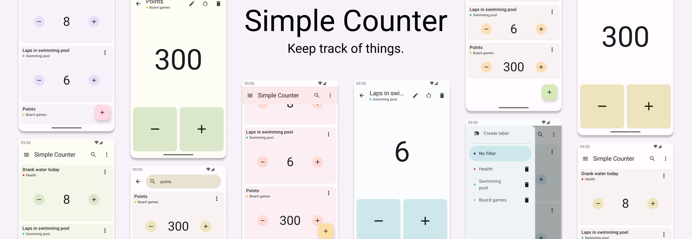

# Simple Counter

</img>

Simple Counter is an app to help you keep track of things.
# Features
- Material 3 UI implemented with Jetpack Compose
- Supports Android 5.0 and up
- Set a default value for a counter to quickly reset to it
- Allow or disallow negative values for a counter
- Mark counters with labels and filter counters by label
- Open counters in fullscreen view
- Use volume keys to change counter value while in fullscreen mode
- Option for compact counter cards
# Libraries used
- [AndroidX](https://github.com/androidx/androidx) (Compose, Lifecycle, Room, DataStore, AppCompat, Navigation)
- [Google Accompanist](https://github.com/google/accompanist)
# License
   Copyright 2023 quicksc0p3r

   Licensed under the Apache License, Version 2.0 (the "License").
   You may obtain a copy of the License at
   
   http://www.apache.org/licenses/LICENSE-2.0

   Unless required by applicable law or agreed to in writing, software
   distributed under the License is distributed on an "AS IS" BASIS,
   WITHOUT WARRANTIES OR CONDITIONS OF ANY KIND, either express or implied.
   See the License for the specific language governing permissions and
   limitations under the License.